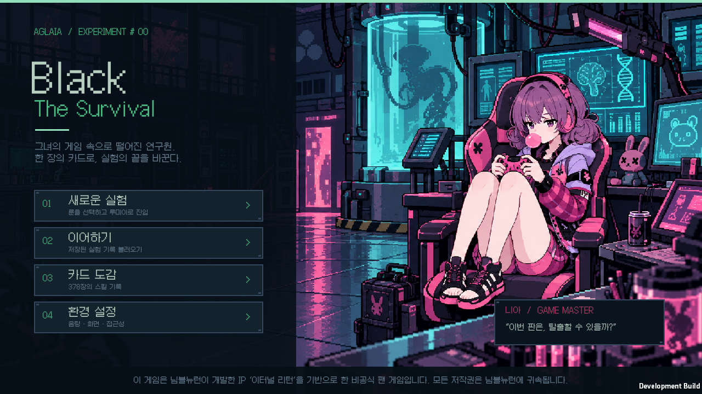

# Black The Survival

연구원 **하나**가 **니아의 VF 게임 월드**에 들어가 탈출하는 도트 그래픽 덱 빌딩 팬 게임. Unity **6000.3.11f1**에서 구현했습니다.

## 실행

- [Windows 다운로드](https://github.com/JSKS17/BlackTheSurvival/releases): ZIP을 폴더에 모두 압축 해제한 뒤 `BlackTheSurvival.exe`를 실행하세요. 최신 배포 버전은 [v0.1.10](https://github.com/JSKS17/BlackTheSurvival/releases/tag/v0.1.10)에 있습니다.
- 소스에는 Unity 프로젝트와 제작·검증 자료가 포함됩니다. Unity 캐시·개인 환경 설정·빌드 출력·개인 이어하기 저장은 포함하지 않습니다. Unity **6000.3.11f1**에서 프로젝트 루트를 열면 됩니다.
- Unity에서 이 프로젝트를 열고 **Play**를 누르면 로비가 나타납니다. `SampleScene`에 오브젝트를 직접 배치할 필요 없이 런타임 부트스트랩이 게임을 시작합니다.
- 완성된 Windows 빌드가 있으면 `Build/Windows/BlackTheSurvival.exe`를 실행하세요. 같은 폴더의 `BlackTheSurvival_Data`, `MonoBleedingEdge`, `UnityPlayer.dll`도 함께 있어야 합니다.
- Unity 메뉴 **Black The Survival → Build Windows game**으로 다시 빌드할 수 있습니다.

## 플레이

1. 메인 룬과 같은 계열 보조 룬을 각각 하나 선택합니다.
2. 제시된 패시브 3개 중 하나를 고릅니다. 선택지 리롤은 2번입니다. 보유 패시브 주인의 Q/W/E/R 스킬은 시작 카드·카드 리롤·야생동물 보상의 무작위 선택지에서 추첨 가중치가 1.5배가 됩니다. 여러 패시브의 주인에게 각각 적용되며 같은 주인은 중첩되지 않습니다.
3. 코스트 0~4인 스킬 카드 6개 중 3장을 고릅니다. 리롤은 2번이며 이미 선택한 카드는 그 위치에 남습니다. 기본 공격 5장과 경계 3장이 함께 들어갑니다.
4. 분기 지도에서 빛나는 연결 구역을 클릭합니다. 새 게임은 각 막 12구역, 총 36구역을 진행합니다. 지도를 가로로 스크롤하여 경로를 확인하세요.
5. 전투에서 손패를 클릭합니다. 카드 코스트는 0~7이며, 최대 코스트는 5로 시작해 보스 승리마다 1 증가합니다. 일부 실험체 조우에서도 영구적으로 1 올릴 수 있습니다. 레벨 상승은 최대 코스트를 올리지 않습니다. 쿨다운 초기화는 대상 카드의 이번 턴 무료 사용권으로, 일부 쿨다운 감소는 다음 사용의 코스트 할인으로 변환했습니다. 할인 후 코스트가 0이거나 무료 사용권이 있으면 남은 코스트가 0이어도 사용할 수 있습니다. 상세 설명에서 연계 대상을 확인하세요.
6. 보상 예산 안에서 카드를 선택합니다. 선택한 카드를 다시 누르면 취소되고 예산이 돌아옵니다. **선택 확정**을 눌러야 덱에 추가됩니다. 선택 없이 진행할 수도 있습니다. 0코스트 카드의 획득 가격은 1입니다. 야생동물 승리 시 기존 기술 선택지 3장에 더해 3% 확률로 기본 공격 1장이 선택지에 추가되고, 독립적으로 50% 확률로 고기 1개를 가방에 받습니다. 아야·현우·유키·아이작·리오·마커스 조우에서도 기본 공격 1장을 얻는 행동을 고를 수 있습니다.
7. 키오스크에서 재료·음식을 구매하고 모닥불에서 장비를 제작하거나 요리하세요. VF혈액샘플은 두 번째 보스 승리 후 구매할 수 있고, 만년 스프와 완성 요리는 키오스크에서 판매하지 않습니다. 모닥불의 장비 이름 검색과 옵션 태그를 함께 사용하여 원하는 장비를 찾을 수 있습니다. 오른쪽 상단 **덱 / 장비 / 가방**에서 회복 아이템을 사용합니다.
8. 마지막 보스 니아를 이기면 탈출합니다. 체력이 0이 되면 실험이 종료됩니다.

지도 하단에서 1~3막의 보스 이름·도트 스프라이트·처치 여부를 미리 확인할 수 있습니다. 각 막의 보스 노드에도 실험체가 표시됩니다. 원정 시작 시 확정하여 저장하며 지도 확인·불러오기로 다시 뽑지 않습니다. 이전 저장은 처치한 보스와 진행 중인 보스전을 보존하여 보완합니다.

다른 실험체의 카드가 서로 보완하는 [8종 교차 연계](docs/CROSS_SUBJECT_SYNERGY_PLAN.md)를 적용했습니다. 에키온·블레어의 VF 공명, 아이솔·로지·셀린·테오도르의 폭파 연계와 기름 점화·상처·넉백·기동·꽃과 나비·보호 지원을 사용할 수 있습니다. 고유 자원을 유지하며 외부 효과에 턴당 횟수와 추가량 제한을 적용합니다. 무료 카드는 준비를 소비할 수 있지만 새 외부 준비를 만들지 않습니다. 조건은 카드 상세에서, 준비와 이번 턴 제한은 필드 효과에서 확인하세요.

## 구현 범위

| 요소 | 현재 내용 |
|---|---|
| 구역 | 야생동물, 실험체, 키오스크, 모닥불, 실험체 조우, 보스 |
| 야생동물 | 닭, 들개, 멧돼지, 늑대, 곰. 회피율 0%, 동물별 오브젝트 드롭 규칙 |
| 카드 | 392장: Q/W/E/R 364장, 기본 2장, 무기 23장, 전술 3장. 모든 미리보기의 공통 요약과 상세 창의 요약·전체 설명 전환 |
| 전투 실험체 | 91명. 기본 공격·방어, 자기 Q/W/E/R·무기군 D·무작위 F·자기 패시브. 레벨 8부터 장비, 후반·보스는 최대 5부위 |
| 실험체 이벤트 | 91명 × 고유 조우 1개·행동 3개. 캐릭터별 상황과 거래·위험·보상의 차이. 고정 보상은 카드 이름·슬롯·코스트와 상세 미리보기 표시 |
| 패시브 | 실험체 91명의 패시브. 최대 3개, 보스 보상에서 획득·교체·포기. 주인 스킬의 무작위 등장 가중치 1.5배 |
| 룬 | 메인 8개, 보조 8개. 같은 계열 선택, 특정 이벤트에서만 변경 |
| 장비 | 전설·초월 51개. 무기·옷·머리·팔/장식·다리 각각 2개까지 착용. 치명타 관련 장비와 10종 옵션 태그 검색 |
| 음식 | 14종. 원재료 5종의 모닥불 조리와 완전 회복 만년 스프 |
| 레벨 | 플레이어·상대 최대 20. 플레이어 최대 코스트는 시작 5 + 보스 승리·조우의 영구 보상. 상대의 최대 코스트는 레벨에 따라 5~8 |
| 그래픽 | 160×160 픽셀의 얼굴·눈매를 구분한 스프라이트 92개. 카드 392종·패시브 91종, 룬 16종·오브젝트 5종·장비 51종·크레딧·모닥불·지도 4종의 전용 도트 아이콘. 니아 로비, 전투 배경, 야생동물·음식 도트 그림과 한글 도트 글꼴 |
| 로비 | 새 게임, 이어하기, 환경 설정, 검색 가능한 카드 도감, 요청한 IP·저작권 문구 |
| 저장 | 행동마다 자동 저장. 손패·버린 카드·상대 행동·난수 상태까지 복원 |
| 전투 연출 | 모든 카드에 효과 유형·색·고유 패턴 지정. 도트 탄환·참격·폭발·번개·불꽃·얼음·마법·방어·회복·이동 연출과 8비트 효과음. 적 카드도 순차 재생 |

실험체 91명의 전투와 이벤트가 연결되어 있으며, 모든 등록 실험체와 하나가 큰 머리·짧은 팔다리의 치비 도트 스프라이트를 사용합니다. 카드에는 큰 스킬 아이콘과 작은 소유 실험체 스프라이트를 함께 표시하고, 적 행동 예고·기술 배너·패시브 화면에도 전용 아이콘을 사용합니다. 원본 스킬명·쿨다운·음식·장비의 출처와 적용 시점은 [docs/SOURCES.md](docs/SOURCES.md), 추가 81명의 개별 스킬 출처는 [클래식 자료](docs/ROSTER_CLASSIC.md)와 [최근 자료](docs/ROSTER_RECENT.md)에 기록합니다. 피해량, 회복량, 턴 효과와 크레딧 보상은 이 팬 게임용 수치입니다.

Q/W/E/R 364종은 실험체별 스택·표식·설치물·소환·지연 공격·반격·다음 카드 할인으로 연계됩니다. 니아 Q는 아케이드 블록 수치를 최대 3까지 증가시키며 W는 사용 전 블록마다 피해가 4 증가하고 블록을 소비하여 다음 Q의 코스트를 1 줄입니다. 전투 화면의 **필드 효과**를 눌러 양측의 누적·지속 효과를 확인할 수 있습니다. 각 실험체의 변환과 상한은 [기본 10명](docs/SKILL_IDENTITY_CORE.md), [클래식 55명](docs/SKILL_IDENTITY_CLASSIC.md), [최근 26명](docs/SKILL_IDENTITY_RECENT.md)에 기록합니다.

패시브 91종은 주인의 카드가 없어도 공통 전투 행동으로 발동합니다. 아이작은 기본 공격마다 추가 피해를 주고 세 번째 기본 공격에서 추가 피해와 회복을 얻습니다. 룬 16종에도 원본을 참고한 발동 조건·재사용 대기·횟수 제한을 적용했습니다. 증폭 드론은 어느 실험체의 R이든 사용하면 현재 턴과 다음 턴의 최대 코스트가 1 증가하고 공격 피해가 조금 증가합니다. [패시브 변환 기록](docs/PASSIVE_IDENTITY_CLASSIC.md), [최근 패시브 기록](docs/PASSIVE_IDENTITY_RECENT.md), [룬 변환 기록](docs/RUNE_IDENTITY.md)에서 세부 수치를 확인할 수 있습니다.

그림은 내장 `image_gen`으로 새로 제작했습니다. 최종 리소스는 `Assets/Resources/Lumia/Portraits/{id}.png`, `SkillIcons/{id}.png`, `PassiveIcons/{id}.png`에 있습니다. [아트 설명](docs/ART.md), [치비 아트 제작 방식](docs/ART_CHIBI.md), [실제 생성 프롬프트](docs/art-chibi/prompts.json), [원본 아틀라스 배치](docs/art-chibi/batches.json), [아이콘 배치](docs/art-chibi/icon-batches.json), [최종 파일·원본 좌표·해시](docs/art-chibi/processed-art-index.json), [아트 검증 기록](docs/art-chibi/art-validation.json)을 함께 보관합니다.

캐릭터 스프라이트는 `PortraitsIdentity/{id}.png`를 우선 사용하고 80픽셀로 다시 줄이지 않습니다. GBA 포켓몬·모에몬 표현을 참고해 눈매·눈썹·표정·안경·수염을 개별 설계했습니다. [얼굴 설계](docs/art-identity/face-designs.json)와 [개별 생성 원본·프롬프트·해시](docs/art-identity/asset-index.json)를 보존합니다. 시스템 아이콘 78개는 원본의 실루엣과 색을 참고하여 개별 제작했고, `SystemIcons/{id}.png`에서 불러옵니다. 모두 32픽셀 격자를 64픽셀 PNG로 확대해 또렷한 2×2 도트와 투명 배경을 유지합니다. 여제·생사부는 원본 형태에 맞춰 교정했습니다. 참고 이미지·실제 프롬프트·원본 및 출력 해시는 [시스템 아트 제작 기록](docs/art-system/README.md)에 있습니다.

원본 기술에 따라 기절·속박·침묵·실명·둔화·공포·매혹·제압·변이 등의 상태를 부여합니다. 이동 제한과 기술 봉인은 카드 종류에 적용하고, 기절 등 하드 제어는 다음 턴 코스트를 최대 2 줄이되 최소 1을 남깁니다. 같은 상태는 수치가 중첩되지 않으며 대상의 턴 종료에 기간이 줄어듭니다. 카드 상세와 필드 상세에 효과와 기간을 표시합니다. 치유 드론은 피해를 받아 체력이 최대 체력의 1/3 이하가 됐을 때 발동합니다. 중후반·보스 체력을 올리고 전투 크레딧을 줄인 난도 조정도 적용했습니다.

카드 미리보기는 상세 창의 요약과 같은 짧은 텍스트를 사용하며 내부 스크롤이 없습니다. 상세 창의 전체 설명에서 모든 효과를 읽을 수 있습니다. [실제 요약](docs/DESCRIPTION_SUMMARIES.md)에 발동 조건과 수치를 기록했습니다. 양측 필드 창에서 상태이상과 현재 회피율·일반 공격 치명타 확률까지 확인합니다.

발동 조건이 같은 카드·패시브·룬·장비 효과는 조건을 한 번만 표시하고 연결된 문장으로 묶습니다. 제한이 모두 같으면 쿨다운·턴당·전투당 횟수를 한 번 표시하며, 제한이 다르면 해당 효과 옆에 표시합니다. 사용 전·후와 현재 공격·다음 기본 공격·설치물 적중처럼 서로 다른 시점은 구분합니다. 효과의 수치와 실제 발동 규칙은 유지합니다.

디버프를 부여하는 카드의 **전체 설명 맨 아래**에는 `디버프 설명`을 표시합니다. 부여하는 각 디버프의 효과·지속·재부여 규칙을 한 번씩 설명하며, 조건부·다음 일반 공격·설치물의 지연 발동도 포함합니다. 요약과 디버프를 부여하지 않는 카드에는 이 설명을 붙이지 않습니다.

치명타는 **일반 공격 카드**에만 적용합니다. 장비의 치명타 확률은 5~6%로 낮게 설정했고 총 상한은 30%입니다. 적중 시 공격 피해가 1.5배가 되며 소수점은 버립니다. 별도로 발동하는 패시브·장비 추가 피해에는 치명타가 적용되지 않습니다. [원작 장비와 변환 수치](docs/CRITICAL_EQUIPMENT.md)를 기록했습니다. 키오스크 주변은 같은 막에서 앞뒤 한 단계로 직접 연결된 전투 구역만 표시합니다.

장착한 무기마다 해당 D가 덱에 들어갑니다. 알렉스 패시브가 있으면 무기마다 다른 무기군 D도 1장씩 받습니다. 장비 지급 카드를 별도로 추적하여 교체 후에도 다른 경로로 얻은 D는 남습니다. [장비와 적 구성](docs/EQUIPMENT_LOADOUTS.md)에 원본 효과 변환을 기록했습니다. 오브젝트 드롭률은 늑대 25%, 곰 35%, 키오스크 주변 실험체 25%입니다. 추가 장비·D 아이콘 32개는 [개별 제작 기록](docs/art-system/loadout-asset-index.json)을 보관합니다.

캐시 Q는 이번 적중으로 상처가 최대치 3에 도달해야 무료 재사용을 얻습니다. 쇼이치·셀린·얀·칼라·비앙카도 단검·폭탄·강화·작살·혈액 준비가 필요합니다. 조건과 횟수는 카드 요약·전체 설명에 표시하며, [기술 연계 조건](docs/CONDITIONAL_RECASTS.md)에 정리했습니다.

## 사운드

공식 공개 OST **Summertime·Golden Willow·Red Heart**를 로비·탐험·전투 등 상황에 맞춰 재생합니다. 원본 한국어 스킬 보이스 339개, 니아 상황 보이스 10개, 아나운서 보이스 4개도 포함합니다. 공개 팬키트에 원본이 없는 매칭·야생동물·키오스크·제작·요리 등은 이 프로젝트에서 제작한 효과음 65개로 보완했습니다. 원본 로비 테마나 모든 기술의 원본 효과음을 가져온 것은 아닙니다. [음원 구성과 출처](docs/AUDIO.md)를 확인할 수 있습니다.

환경 설정에서 **전체 음량·음악·효과음 및 보이스**를 각각 조절하고 소리 전체를 끌 수 있습니다. 화면을 바꿀 때 음악이 부드럽게 전환되고, 같은 곡을 쓰는 화면에서는 재시작하지 않습니다. 카드·상태이상·패시브가 동시에 발동해도 중복 효과음과 보이스가 과도하게 겹치지 않도록 제한합니다.

## 저장과 설정

Unity의 `Application.persistentDataPath` 아래 `lumia-vf-loop-v1.json`에 저장하며 이전 파일은 `.bak`으로 남깁니다. 설정은 Unity `PlayerPrefs`에 저장됩니다. 새 게임을 시작하면 활성 저장 슬롯을 교체합니다. 자동 화면 검증은 `lumia-verification.json`이라는 별도의 슬롯을 사용합니다.

게임 이름 변경 후 새 제품 폴더에 기록이 없으면 이전 **Lumia VF Loop**의 저장·백업을 자동으로 가져옵니다. 음량·효과음·모션 설정도 새 설정이 없으면 가져옵니다. 기존 새 이름의 기록을 덮어쓰거나 이전 파일을 삭제하지 않습니다.

저장 형식은 버전 2이며 파일명은 호환성을 위해 유지했습니다. 기존 7구역 지도와 진행 중 보상은 그대로 이어집니다. 예전 보상에서 이미 선택한 카드는 확정 전 선택 상태로 옮겨지고, 당시 획득 가격과 원래 예산을 보존합니다. 새 12구역 지도는 새 게임부터 적용됩니다.

이전 준비 단계 저장은 당시 카드 선택지와 선택한 카드를 보존합니다. 명시적으로 카드를 다시 뽑을 때부터 패시브의 등장 가중치를 적용합니다. 새 게임에서는 첫 패시브 선택부터 적용하며, 같은 패시브를 반복해서 선택해도 새로운 카드 리롤은 발생하지 않습니다.

새 전투 효과는 저장할 때 함께 기록됩니다. 이번 변경 이전의 진행 중 전투를 이어갈 때 시작 시점 효과를 소급 지급하지 않으며, 전투 시작 방어·자원·부활 준비는 다음 전투부터 적용됩니다. 카드 사용·적중·피격 등 행동에 반응하는 새 효과는 이어가는 전투에도 적용됩니다.

## 개발·검증

- `Assets/Scripts/Lumia/DataModels.cs`: 확장 가능한 데이터 정의.
- `GameDatabase.cs`: 카드·장비·음식·룬·패시브·실험체·이벤트.
- `ClassicRoster.cs`, `RecentRoster.cs`: 추가 실험체 81명의 공식 스킬·패시브 변환.
- `CardPresentation.cs`: 코스트 변환, 문장형 설명과 효과 유형.
- `SkillMechanics.cs`, `SkillIdentityCore/Classic/Recent.cs`: 실험체별 스택·표식·설치물·지연 피해와 다음 카드 할인. 91명 Q/W/E/R 364종의 고유 효과.
- `TraitMechanics.cs`, `TraitPresentation.cs`, `PassiveIdentityCore/Classic/Recent.cs`, `RuneIdentityCore.cs`: 주인의 카드 없이 작동하는 패시브 91종과 발동 조건·지속·상한이 있는 룬 16종, 전체 문장형 설명.
- `StatusIdentity.cs`, `StatusMechanics.cs`: 원본 기술별 상태·조건·지연 발동과 턴제 행동 제한·코스트·명중·회복 보정.
- `EventIdentity.cs`, `EventPresentation.cs`: 91명의 고유 조우·273개 행동과 정확한 고정 보상·거래 대가 표시.
- `CombatEffects.cs`: 카드별 도트 애니메이션·피해 숫자·8비트 음향.
- `CrossSubjectSynergies.cs`: 서로 다른 실험체 사이의 8종 연계·유료 준비·턴당 제한·공통 설명. 플레이어·적·예고에 같은 판정을 사용합니다.
- `GameEngine.cs`: Unity UI와 독립된 규칙·결정론적 난수·진행 상태.
- `GameIdentity.cs`: 제품 이름과 이전 제품 저장·환경 설정의 자동 이전.
- `LumiaGame.cs`: 로비 및 전체 플레이 화면·저장.
- `PixelArt.cs`: 전용 치비 스프라이트·스킬·패시브 아이콘 로드, 도트 지도와 기존 아틀라스 슬라이스.
- `Assets/Editor/LumiaProjectSetup.cs`: Point 필터·무압축·밉맵 없음·알파 보존을 적용하는 이미지 임포트 설정.
- `Tools/VerifyArtAssets.ps1`: 92개 스프라이트·392개 카드·91개 패시브 리소스의 누락·중복·원본 대응 검증.
- `Tools/ValidateSystemArt.py`: 시스템 아이콘 78개와 굵은 스프라이트 92개의 누락·투명도·크기·픽셀 격자·원본 출처·해시 검증.
- `Tools/RunCoreTests.ps1`: 순수 C# 규칙 검증. `-Balance`로 실제 행동만 사용하는 40회 자동 플레이도 실행합니다.
- `Tools/VerifyRuntime.ps1`: Unity 런타임 소스 컴파일 검증.
- `Tools/BuildVerification.ps1`: 현재 열려 있는 프로젝트를 유지하며 검증용 복사본에서 Windows 개발 빌드. `-Release`는 개발 표시를 끈 빌드입니다. `-DisableBurst`는 해당 빌드 프로세스의 선택적 Burst 컴파일을 건너뛰며 프로젝트 설정은 바꾸지 않습니다. 이 게임의 규칙·UI 코드는 Burst를 사용하지 않습니다.
- 개발 빌드에 `-lumia-verify`를 전달하면 보상 선택·취소, 무료 연계, 전투 효과, 니아 블록·할인, 패시브 누적·부활 준비, 상대 기술 상세, 룬 버프·저체력 치유·상점 할인, 조우 고정 카드·거래·체력 대가, 장비 아이콘·상태이상·기본 공격 조우·야생동물 추가 카드·고기 보상과 같은 조건의 효과 설명·보스 사전 표시·제니 패시브·8종 교차 연계·조건부 재사용을 포함한 130개 화면을 실행 파일 옆 `Verification` 폴더에 캡처하고 종료합니다. 화면 캡처는 실제 창을 표시한 상태로 실행하세요.
- 개발 빌드의 `-bts-identity-verify`는 작업 폴더의 합성 저장과 설정 값으로 이전 동작 27개를 검증하고 `IdentityVerification/results.json`을 기록합니다. 개인 저장·레지스트리 설정은 변경하지 않습니다.
- 개발 빌드의 `-lumia-art-verify`는 모든 전용 아트를 실제 Unity 리소스로 읽고 `ArtVerification` 폴더에 스프라이트 8페이지·기술 및 패시브 아이콘 13페이지·시스템 아이콘 2페이지를 캡처합니다. `-lumia-portrait-verify`는 스프라이트만 확인합니다. 일반 플레이 저장 슬롯을 변경하지 않습니다.

## 안내

이 게임은 님블뉴런이 개발한 IP ‘이터널 리턴’을 기반으로 한 비공식 팬 게임입니다. 모든 저작권은 님블뉴런에 귀속됩니다.

한글 글꼴은 quiple의 Galmuri11이며 SIL Open Font License 1.1입니다. 폰트 라이선스는 `Assets/Resources/Lumia/Galmuri-OFL.txt`에 포함되어 있습니다.

검증 결과는 [docs/VALIDATION.md](docs/VALIDATION.md)에 있습니다.

